## Demo project on Python with Web UI tests for [BookStore DemoQa](https://demoqa.com/books) service

&nbsp;

### Tools and technologies used

### Test coverage
Web GUI-tests:
* User authorization
* Bookstore: search, navigate, view book details
* Profile: View, navigate

* Example of Web test's running (successful login):

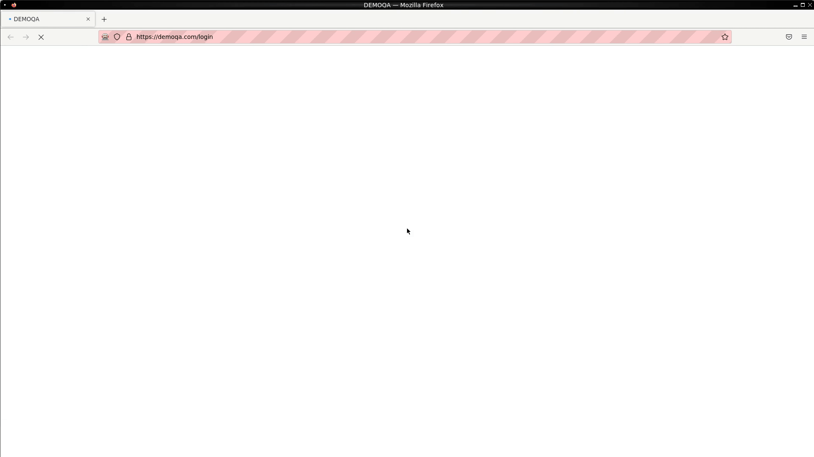&nbsp;

Example of test case in Allure Report:

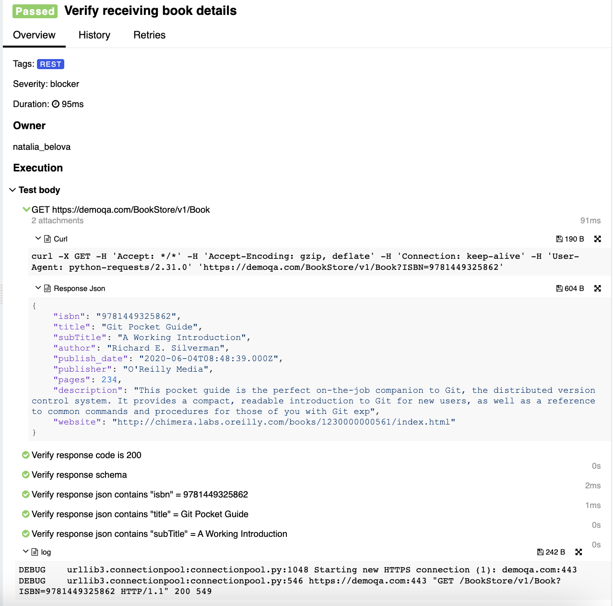&nbsp;

### Test Launch
Tests are launching using **Jenkins service**.
Jenkins is used for test runs. To run tests, go to Jenkins job and click 'Build with parameters', select browser + version (for example, firefox 98.0) click 'Build'.

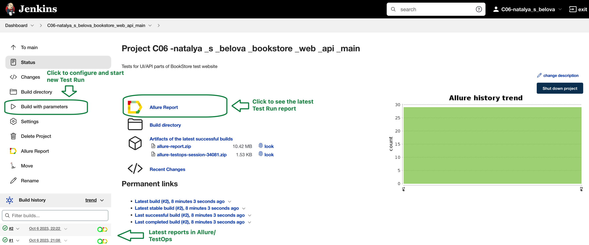&nbsp;
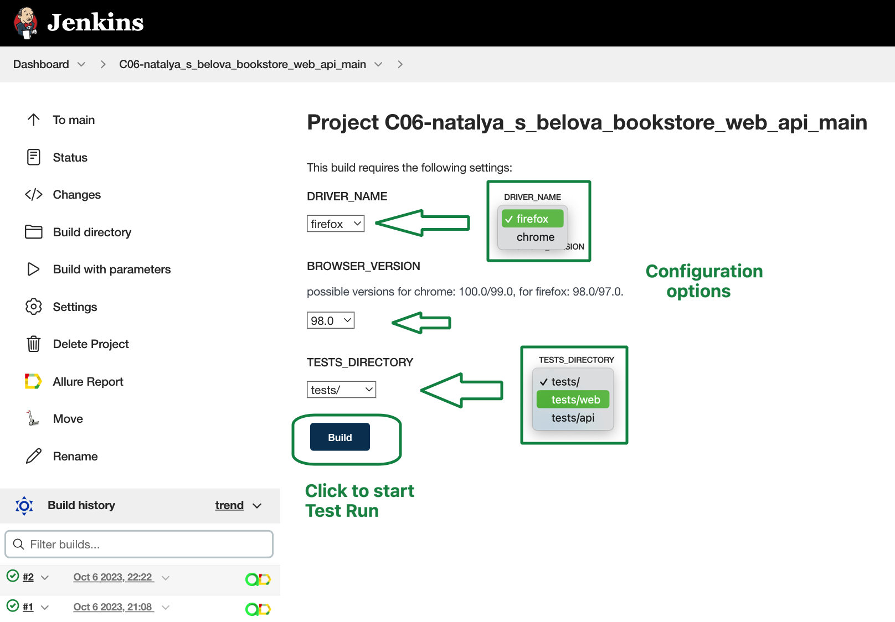&nbsp;

Additionally, integration with Allure TestOps added into same Jenkins job. So you can run Jenkins job with all the tests or specify individual tests to run via Allure TestOps.

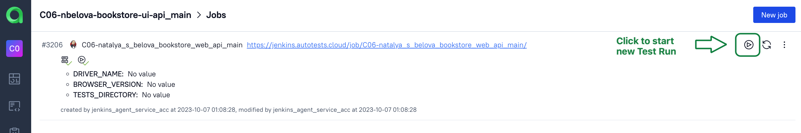&nbsp;

Select individual tests or test groups by their allure decorators:

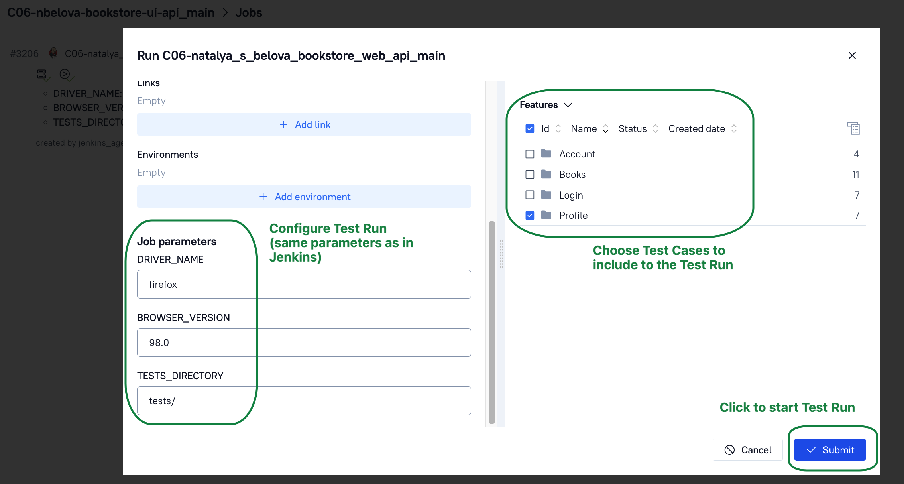&nbsp;

### Test Report and Test Documentation

Reporting is implemented with Allure services.

Allure Report can be opened from Jenkins, see screenshot below. And contains charts, details of test executions, different kinds of attachments (screenshots, logs, video, page html)

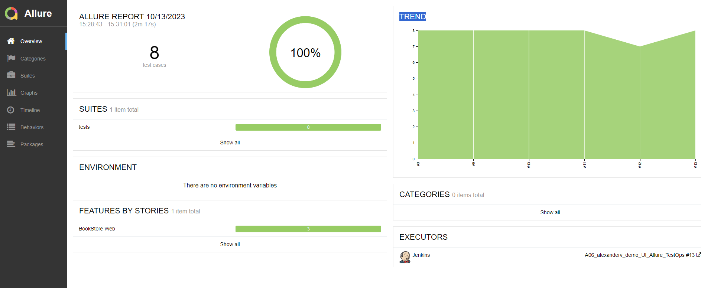&nbsp;
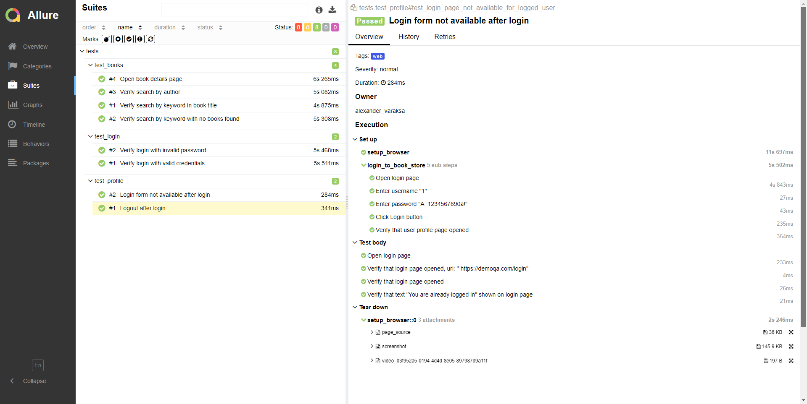&nbsp;

Allure TestOps also contains such information. Also it's generating Test Documentation that can be imported to Jira.
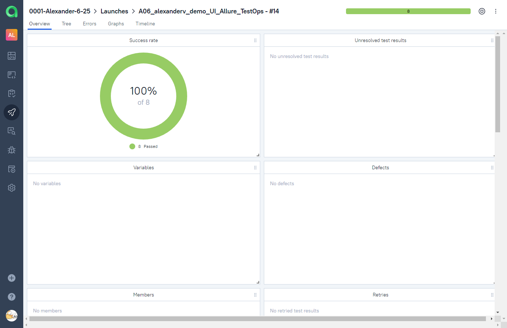&nbsp;
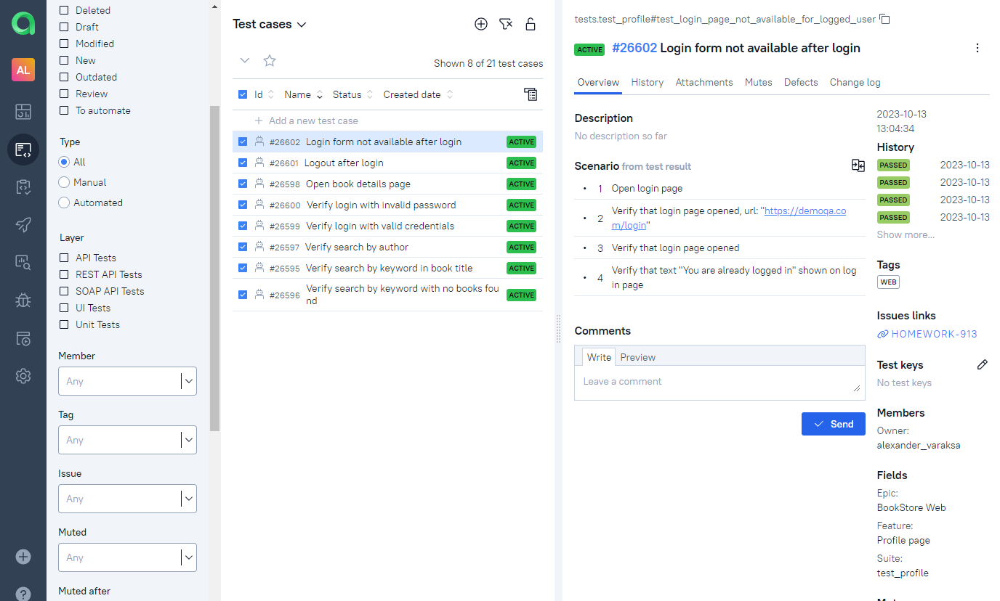&nbsp;

### Integration with Jira

Test Cases and Allure Launches have been integrated into Jira Task:
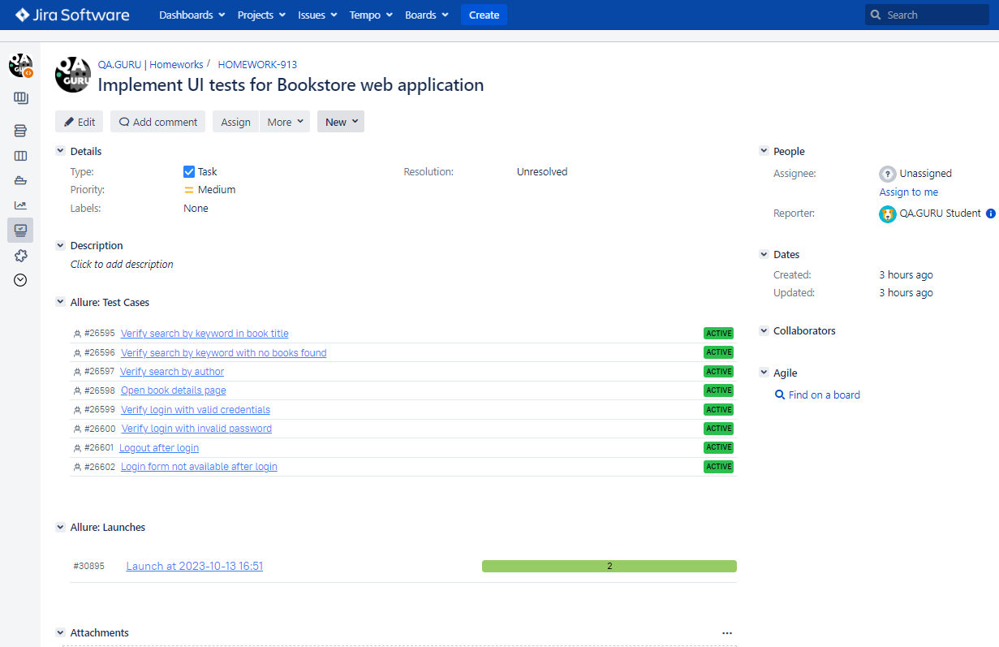&nbsp;

### Test Results Notifications
When test run finished, telegram message with the following data is sent:

* total amount of tests and run duration
* percentage of passed/failed/skipped etc. tests
* link to the test run report

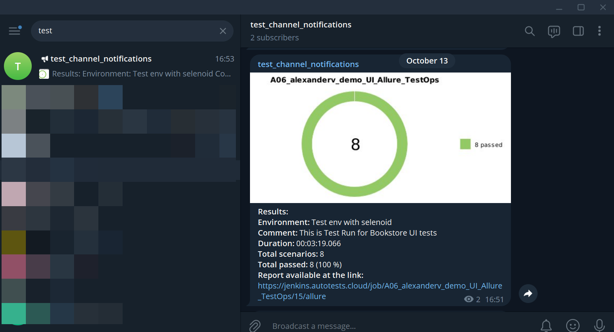&nbsp;

The following tool is used for sending notifications: [allure-notifications library](https://github.com/qa-guru/allure-notifications). Telegram bot was created and added to a specific telegram group

(many different notifications supported: Telegram, Slack, Skype, Email, Mattermost, Discord, Loop)
