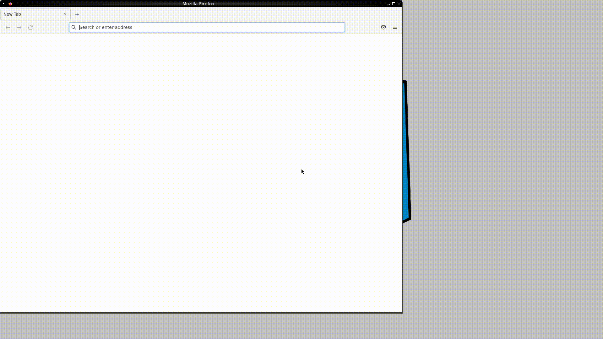
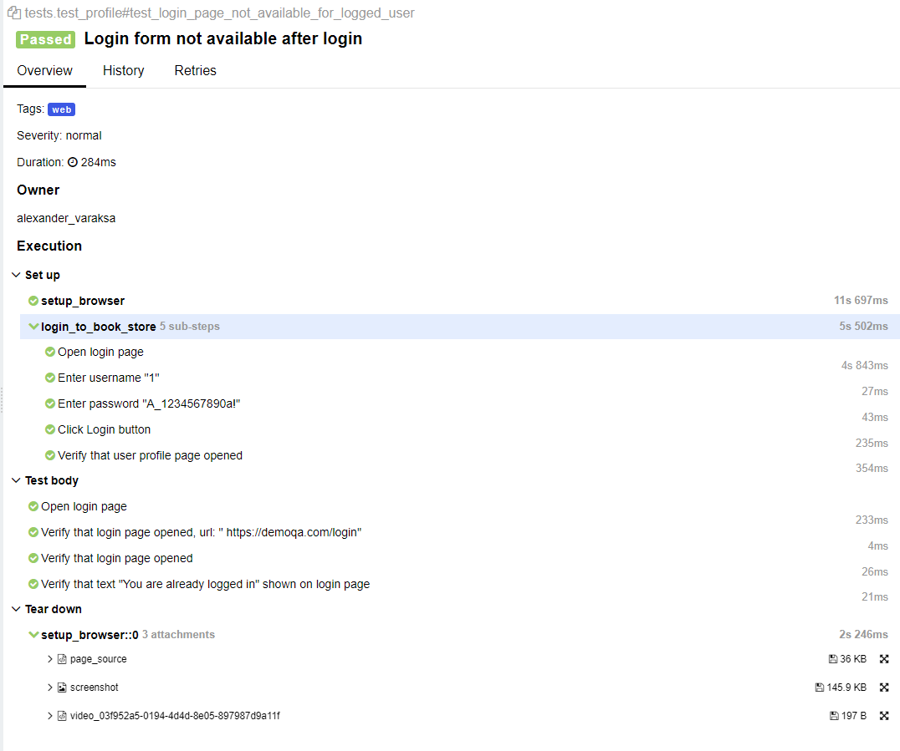
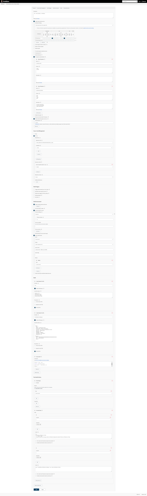
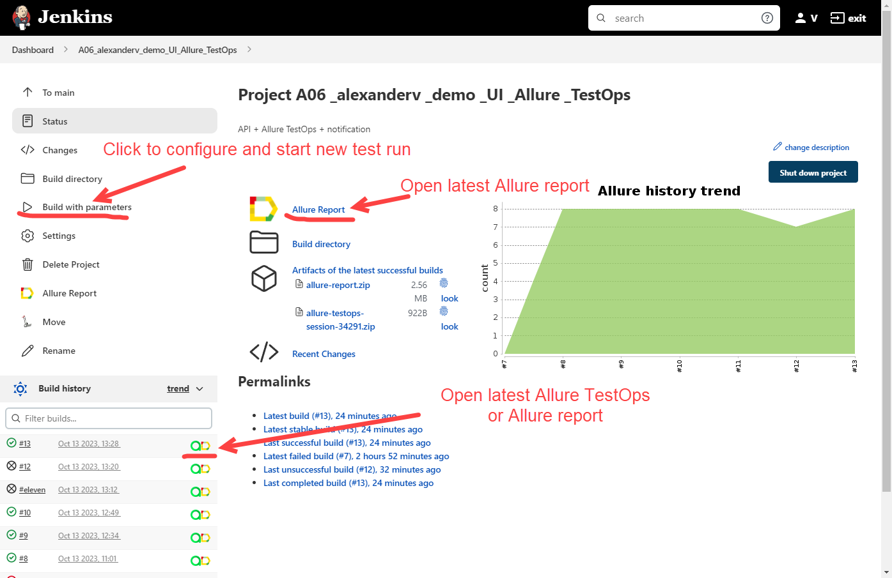
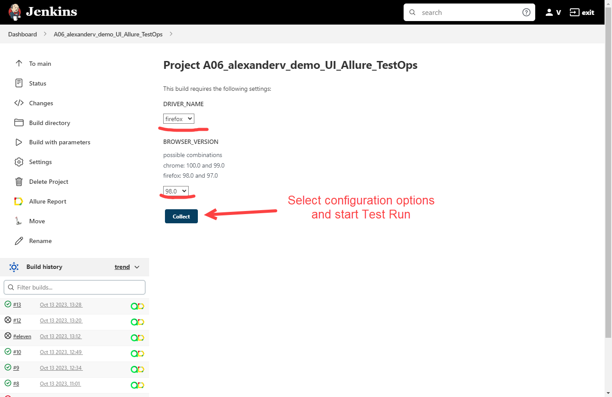
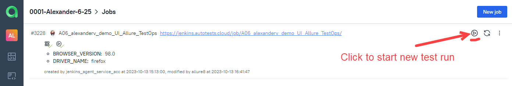
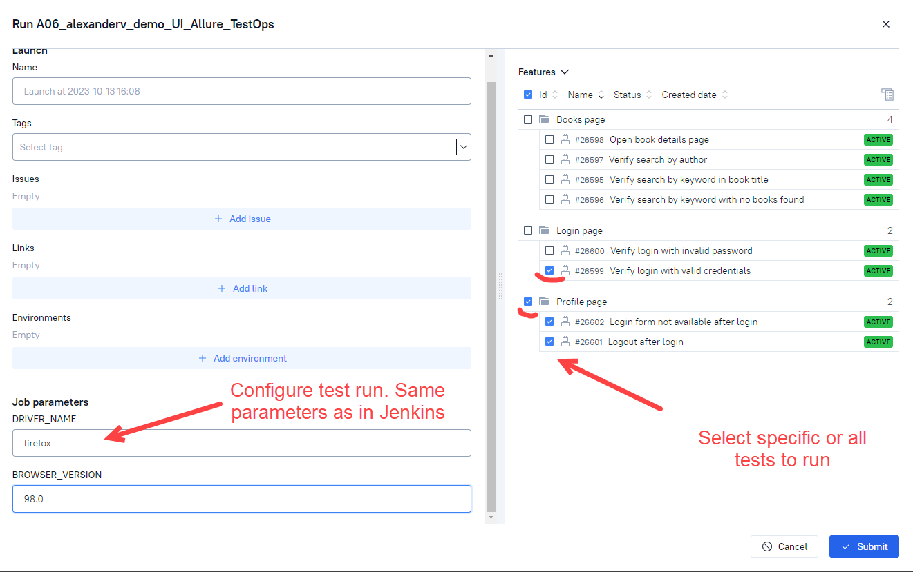
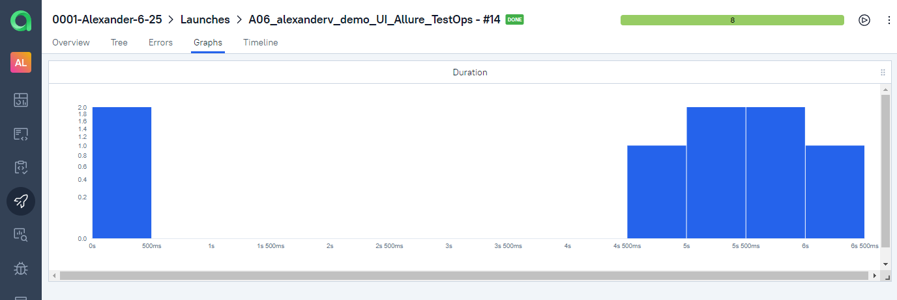

## Demo project on Python with Web UI tests for [BookStore DemoQa](https://demoqa.com/books) web application

&nbsp;

### Tools and technologies used

### Test coverage
Web GUI-tests:
* User authorization
* Bookstore: search, navigate, view book details
* Profile: View, navigate

* Example of recorded test case run (scenario: check no login form after login):

&nbsp;

Example of test case in Allure Report:

&nbsp;

### Jenkins settings
Jenkins is used for test runs. 
Jenkins job configuration is below:

&nbsp;

### Test Launch
To run tests, go to [Jenkins job](https://jenkins.autotests.cloud/job/A06_alexanderv_demo_UI_Allure_TestOps/) and click 'Build with parameters', select browser and version (for example, firefox 98.0) click 'Build'.

&nbsp;
&nbsp;

Additionally, integration with Allure TestOps added into same Jenkins job. 
So you can run Jenkins job with all the tests or specify individual tests to run via Allure TestOps.

&nbsp;

Select individual tests or test groups by their allure decorators, e.g. Profile page (@allure.feature('Profile page')):

&nbsp;

### Test Report and Test Documentation

Reporting is implemented with Allure services.

Allure Report can be opened from Jenkins, see the screenshot above. 
It displays charts, test executions details, different kinds of attachments (screenshots, logs, video, page html)

&nbsp;

Test suite, test steps and attachments:

&nbsp;

Allure TestOps also contains charts and run information. 
Also it's generating Test Documentation that can be imported to Jira.
&nbsp;
&nbsp;
&nbsp;

### Integration with Jira

Test Cases and Allure Launches have been integrated into Jira Task:
&nbsp;

### Test Results Notifications
When test run finished, notification in telegram with the following data is sent:

* total amount of tests and run duration
* percentage of passed/failed/skipped etc. tests
* link to the test run report

&nbsp;

The following tool is used for sending notifications: [allure-notifications library](https://github.com/qa-guru/allure-notifications). Telegram bot was created and added to a specific telegram group

(many other notifications types supported: Slack, Skype, Email, Mattermost, Discord, Loop)
